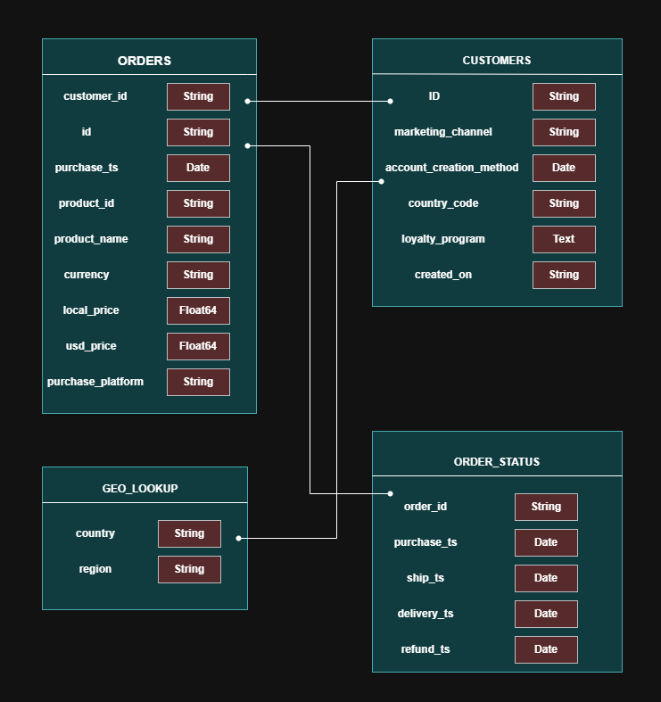

  
 
  
  

 
 <h1 align="center"><b>E-Commerce Performance Report</b></h1>

 ## Client Background:
Nexwave is a U.S.-based e-commerce company selling consumer electronics and accessories across global markets. Founded in 2018, Nexwave scaled rapidly through its website and mobile platforms while navigating increased competition and pandemic-driven market shifts.
This project analyzes Nexwave’s performance from 2019–2022, covering 108,000+ transactions, ~88,000 customers, and $28M+ in revenue, to uncover trends in sales, customer behaviour, loyalty impact, refunds, channels, and regional performance.

## Business Problem: 
As Nexwave expanded its global e-commerce operations, leadership needed a clearer, data-driven understanding of business performance. While transactional data was available, it was not being leveraged effectively to evaluate sales trends, product performance, customer loyalty impact, refund behaviour, and regional growth.
This project aims to consolidate and analyze Nexwave’s data to answer key questions around revenue trends, customer value, operational efficiency, and growth opportunities, enabling stakeholders to make more informed strategic decisions.

<h1 align="center"><b>Executive Summary</b></h1>
<h1 align="center">Sales Revenue Analysis (2019–2022)</h1>

 

•	Nexwave’s sales surged sharply during the 2020 pandemic, peaking at $1.24M in December, before entering a prolonged decline through 2022. 

•	As shown in the chart above, the downturn was driven primarily by declining order volume rather than pricing, as Average Order Value (AOV) remained relatively stable post-pandemic.

•	Revenue is heavily concentrated in high-ticket products and the North American market, increasing sensitivity to demand shifts. While loyalty customers consistently outperform non-loyalty customers across revenue, AOV, and retention, they also exhibit higher refund rates. 

•	These findings point to clear opportunities to reignite demand, strengthen loyalty engagement, diversify acquisition channels, and expand regional growth.

## Data structure and ERD:  

The database contains four tables: Orders, Customers, Geo Lookup and Order status. The data spans the period from 2019 to 2022 and includes over 108,000 transactions.

 

 
## Insights Deep Dive:

<h1 align="center">Sales Trends</h1>

### Sales Revenue

 

•  Sales peaked in Dec 2020 at $1.24M, driven by pandemic-boosted online demand.

•  2022 marked a major downturn, with Dec 2022 revenue falling to ~$178K - a 70–80% drop from prior holiday seasons.

•  The decline was consistent across all quarters of 2022, signaling weaker demand rather than pricing issues.

•  Pandemic surge → 2021 stabilization → 2022 correction, likely influenced by inflation, reduced consumer spending, and stronger competition.

•  The sharp Q4 2022 underperformance suggests retention and demand-generation challenges that may require new marketing and pricing strategies.

### Average Order Value (AOV)

 

•  AOV peaked in late 2020 (~$321) during the pandemic, when customers were spending more per order.

•  From 2021–2022, AOV steadily declined, returning close to pre-pandemic levels (~$220–$240).

•  2022 showed more volatility, with AOV swinging between $215–$255, and holiday-period AOV notably weaker than in prior years.

•  The drop in AOV was gradual (≈25–30% from the 2020 peak) and not the main cause of the 2022 revenue decline - reduced order volume had a much bigger impact.

### Order Count

 

•  Order count is the strongest driver of revenue, closely tracking the rise and fall of monthly sales across all years.

•  Orders peaked in late 2020 (~4,000 orders), then declined steadily through 2021 and sharply in 2022.

•  Order volume fell nearly 40% from 2021 to 2022, confirming that reduced purchase frequency, not AOV was the primary cause of the revenue decline.

•  The steepest drop occurred in mid-2022, with monthly orders falling rapidly into early Q4.

•  By October 2022, orders hit a low of ~825, signaling a significant weakening in customer demand.

## 
<b>The MoM analysis reveals that sales growth fluctuates widely while AOV stays relatively stable, confirming that revenue shifts are driven primarily by changes in order volume rather than customer spend.</b>

 

#
<h1 align="center">Product Performance</h1>

 

<b>Performance of Key Product Categories</b>

•	Revenue was concentrated in a few high-value products (MacBook Air, ThinkPad Laptop, 27” 4K Gaming Monitor, Apple AirPods), which consistently outperformed all other categories.

•	Top products peaked in 2020, with several exceeding $300K+ in monthly revenue during the pandemic demand surge.

•	Sales declined sharply from 2021 to 2022, with most premium products dropping to below $100K per month by late 2022, indicating a broad market slowdown rather than individual product issues.

•	High-ticket products showed significant volatility, experiencing major spikes during peak periods and steep declines afterwards.

•	Lower-priced accessories (charging cables, webcams, Bose headphones) had stable but low revenue, typically under $20K per month, reinforcing Nexwave’s dependency on a small set of premium items for overall revenue.

<b>AOV Over Time (2019-20222)</b>

 

•  Laptops consistently lead AOV, ranging from $1,500–$1,650 through 2019–2021, dipping slightly in 2022.

•  Premium products such as gaming monitors and high-end headphones maintained strong mid-range AOVs ($400–$1,100) across all years.

•  Low-cost accessories (webcams, cables) held AOVs below $150 with little variation year to year.

•  AOV declined only gradually post-2020, showing stable pricing even as demand fell.

•  Indicates that Nexwave’s revenue drop was caused by fewer orders, not lower spending per order. 

#
<h1 align="center">Loyalty Program Learnings</h1>

